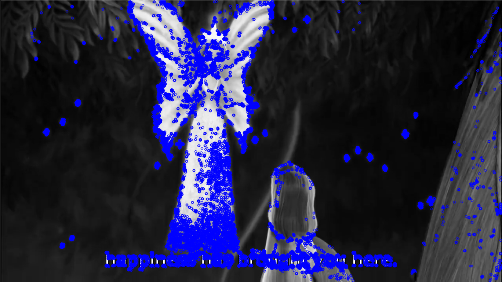
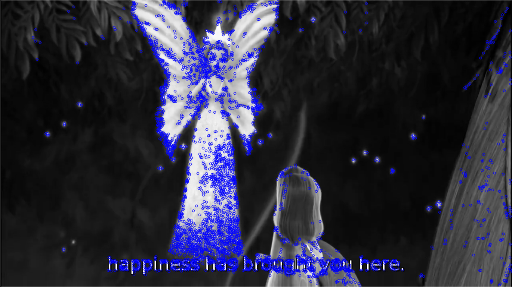
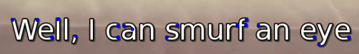
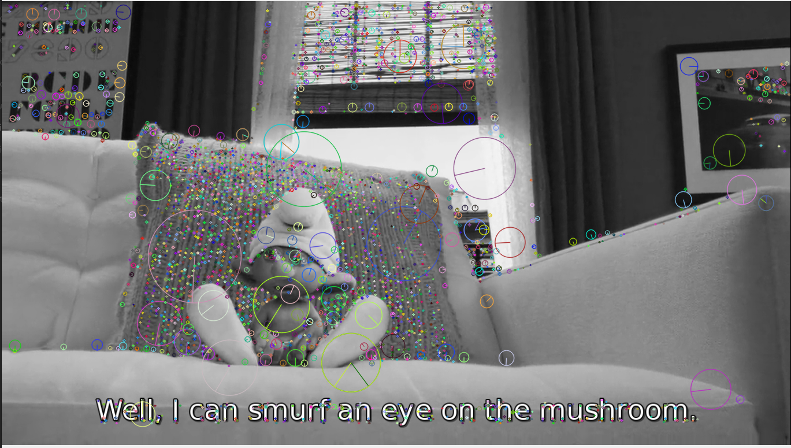

# Feature_Detection
[](https://github.com/rohandubey/Feature_Detection/blob/master/LICENSE)


[](https://pypi.python.org/pypi/trains-jupyter-plugin/) 
<br><br>
## Introduction
Feature Detection is very important understanding an image and marking out the point/region in an image responsible for bringing out the good features of an image. This project contains different methods/approaches how feature detection can be implemented.
## Installation
```
$ pip install -r requirements.txt
```
## Algorithms
### FAST Algorithm for Corner Detection
<i>FAST Algorithm for Corner Detection is a high speed algorithm detects features based on circular intensity, threshold value in a given pixel radius and p roportion of them are stored, then one with 'max' and 'min' intensity are compared to get the feature corner.</i><br>


### Harris Corner Detection
<i>Harris Corner Detection algorithm is based on  difference of intensity for displacement in all directions. </i>

### Shi-Tomasi Corner Detection
<i>This is a faster algorithm similar to Harris corner Detection but instead of diffrence of intensity it chooses minimum intensity and thus reducing the overall compuitation</i> <br>

### SIFT
<i> SIFT (Scale-Invariant Feature Transform) is a rotaion and scale invariant feature detector and thus is helpful as it maks out he boundary of the pixel circle selected and the freature selection based on scaling can be done.  </i>

## Authors
Made with ❤️ Rohan Dubey - Complete work
